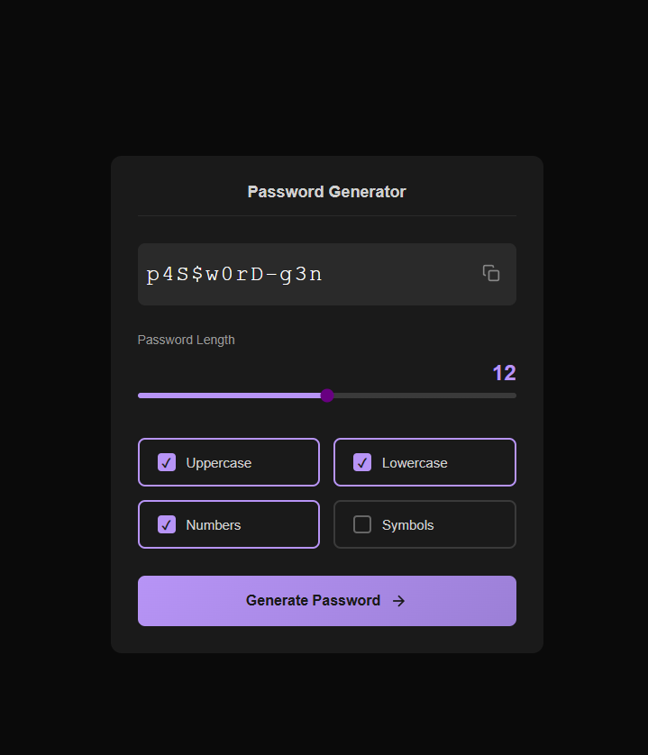

# Password Generator 🔐

A sleek and modern desktop application to generate secure passwords with customizable options. Built with Electron for a native desktop experience!

## 🚀 Features

- ✅ Generate strong, random passwords
- ✅ Customizable password length (4-32 characters)
- ✅ Multiple character type options:
  - Uppercase letters (A-Z)
  - Lowercase letters (a-z)
  - Numbers (0-9)
  - Special symbols (!@#$%^&\*)
- ✅ One-click copy to clipboard
- ✅ Modern dark-themed UI
- ✅ Smooth animations and transitions
- ✅ Lightweight desktop app

## 📸 Screenshot



## 🛠️ Technologies Used

- **Electron** - Desktop application framework
- **HTML5** - Structure
- **CSS3** - Modern styling with gradients and animations
- **Vanilla JavaScript** - Password generation logic

## 📦 Installation

### Prerequisites

- Node.js (v12 or higher)
- npm

### Setup

1. Clone the repository:

```bash
git clone https://github.com/ibrahimmdef/password-generator.git
cd password-generator
```

2. Install dependencies:

```bash
npm install
```

3. Start the application:

```bash
npm start
```

## 🏗️ Building for Production

To create a distributable package for Windows:

```bash
npm run build
```

The packaged application will be created in the `dist/` folder.

## 📁 Project Structure

```
password-generator/
├── src/
│   └── index.html       # Main UI and logic
├── index.js             # Electron main process
├── package.json         # Project configuration
├── .gitignore          # Git ignore rules
└── README.md           # This file
```

## 🎯 Usage

1. Launch the application
2. Adjust the password length using the slider
3. Select which character types you want to include:
   - Toggle Uppercase letters
   - Toggle Lowercase letters
   - Toggle Numbers
   - Toggle Symbols
4. Click "Generate Password" button
5. Click the copy icon next to the password to copy it to clipboard

## 📝 Notes

- At least one character type must be selected
- Password updates automatically when you change settings
- Generated passwords are cryptographically random
- The app window is fixed size (480x591) for optimal user experience

## Contributing 🤝

Feel free to open issues or submit pull requests if you have ideas for improvements!

## 👤 Author

**Ibrahim**

- GitHub: [@ibrahimmdef](https://github.com/ibrahimmdef)

## 📄 License

ISC License - feel free to use this project however you'd like!

## ⭐ Support

If you like this project, don't forget to give it a star!

---

**Security Tip**: Always use strong, unique passwords for each of your accounts. This generator helps you create secure passwords, but remember to store them safely using a password manager!
